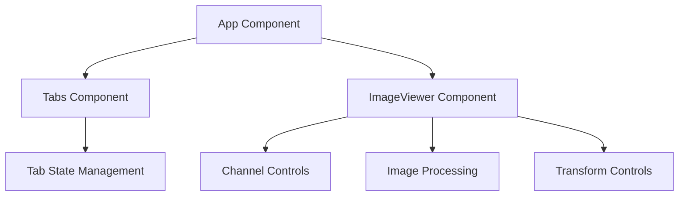
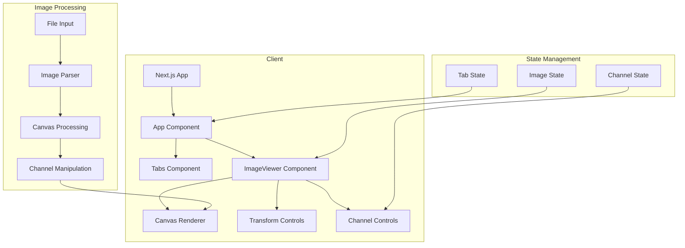
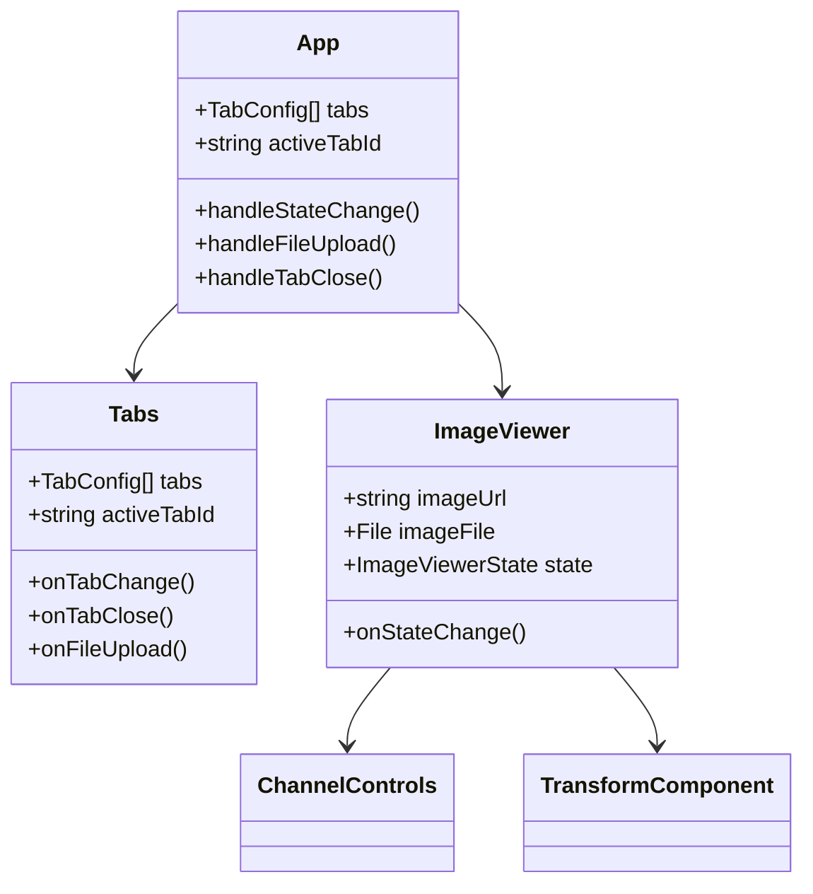
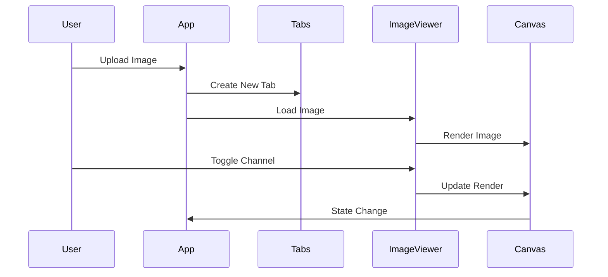
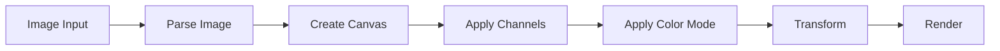
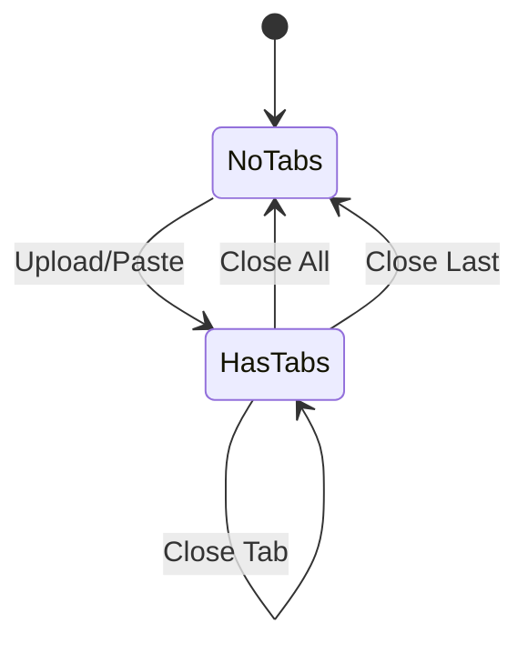

# LWC Image Viewer Documentation

- [LWC Image Viewer Documentation](#lwc-image-viewer-documentation)
  - [Overview](#overview)
  - [Usage Guide](#usage-guide)
    - [Loading Images](#loading-images)
    - [Working with Tabs](#working-with-tabs)
    - [Image Controls](#image-controls)
    - [Keyboard Shortcuts](#keyboard-shortcuts)
  - [Technical Architecture](#technical-architecture)
    - [System Overview](#system-overview)
    - [Component Hierarchy](#component-hierarchy)
    - [Data Flow](#data-flow)
  - [Core Components](#core-components)
    - [1. App Component (Page)](#1-app-component-page)
    - [2. ImageViewer Component](#2-imageviewer-component)
    - [3. Tabs Component](#3-tabs-component)
  - [Image Processing Pipeline](#image-processing-pipeline)
    - [Channel Processing](#channel-processing)
    - [Color Mode Processing](#color-mode-processing)
  - [State Management Patterns](#state-management-patterns)
    - [Tab State Flow](#tab-state-flow)
    - [Image State Management](#image-state-management)
  - [Performance Considerations](#performance-considerations)
  - [Error Handling](#error-handling)
  - [Dependencies](#dependencies)
  - [Development Setup](#development-setup)

## Overview

The LWC Image Viewer (Light-Weight Channel Image Viewer) is a React-based image viewer focused on color channel manipulation. Built with TypeScript and Next.js, it provides a modular architecture centered around three main components: ImageViewer, Tabs, and the main App component.

## Usage Guide

### Loading Images

You can load images in three ways:

1. **Upload Button**

   - Click the "+" button in the top-right corner (or on the landing page)
   - OS file picker will open, with supported file types
   - Select one or multiple images

2. **Drag and Drop**

   - Drag images from your file explorer
   - Drop anywhere in the window
   - Visual feedback shows when you're in the drop zone

3. **Clipboard Paste**
   - Copy an image (from browser, screenshot, etc.)
   - Press Ctrl+V (Cmd+V on Mac) anywhere in the app
   - A new tab will open with the pasted image

### Working with Tabs

- **Switch Tabs**: Click on any tab to view that image
- **Close Tab**:
  - Click the X button on the tab
  - Middle-click the tab
- **Close All**: Click the stacked papers icon on the left of the tab bar

### Image Controls

1. **Channel Controls**

   - Toggle individual RGBA channels using the channel buttons
   - Shift+Click a channel to solo it (turn off all others)
   - Shift+Click on a soloed channel to show all channels again
   - All channels button to show all channels

2. **View Controls**

   - Pan: Click and drag the image
   - Zoom: Mouse wheel, pinch gesture or double click the image
   - Fit to View: Press F key or click the fit button

3. **Display Mode**
   - Toggle between RGB and B&W modes using the mode switch button
   - RGB shows full color with active channels
   - B&W shows grayscale representation

### Keyboard Shortcuts

| Action      | Shortcut |
| ----------- | -------- |
| Fit to View | F        |
| Paste Image | Ctrl+V   |

## Technical Architecture

### System Overview



---



### Component Hierarchy



### Data Flow



## Core Components

### 1. App Component (Page)

The root component managing global state and coordination between components.

```typescript
interface AppState {
  tabs: TabConfig[];
  activeTabId: string | null;
  isDragging: boolean;
}

interface TabConfig {
  id: string;
  title: string;
  imageUrl: string;
  imageFile?: File;
  state: ImageViewerState;
}

interface ImageViewerState {
  channels: Channel;
  zoom: number;
  position: { x: number; y: number };
  rotation: number;
}
```

Key Responsibilities:

- Global state management
- File upload handling
- Tab coordination
- Drag and drop implementation

### 2. ImageViewer Component

Core image manipulation component with canvas-based rendering.

```typescript
interface ImageViewerProps {
  imageUrl: string;
  imageFile?: File;
  initialState?: ImageViewerState;
  onStateChange?: (state: ImageViewerState) => void;
}

interface Channel {
  red: boolean;
  green: boolean;
  blue: boolean;
  alpha: boolean;
}
```

Internal State Management:

```typescript
const [channels, setChannels] = useState<Channel>(
  initialState?.channels ?? {
    red: true,
    green: true,
    blue: true,
    alpha: true,
  }
);
const [colorMode, setColorMode] = useState<"rgb" | "bw">("rgb");
const [isLoading, setIsLoading] = useState(true);
const canvasRef = useRef<HTMLCanvasElement>(null);
const transformRef = useRef<any>(null);
```

### 3. Tabs Component

Manages tab interface and tab-related operations.

```typescript
interface TabsProps {
  tabs: TabConfig[];
  activeTabId: string | null;
  onTabChange?: (tabId: string) => void;
  onTabClose?: (tabId: string) => void;
  onFileUpload?: (event: React.ChangeEvent<HTMLInputElement>) => void;
  onCloseAll?: () => void;
}
```

Event Handling:

```typescript
const handleTabClick = (e: React.MouseEvent<HTMLDivElement>, tabId: string) => {
  if (e.button === 1) {
    handleTabClose(e, tabId);
    return;
  }
  onTabChange?.(tabId);
};
```

## Image Processing Pipeline



### Channel Processing

```typescript
const processChannels = (data: Uint8ClampedArray, channels: Channel) => {
  for (let i = 0; i < data.length; i += 4) {
    if (!channels.red) data[i] = 0;
    if (!channels.green) data[i + 1] = 0;
    if (!channels.blue) data[i + 2] = 0;
    if (!channels.alpha) data[i + 3] = 255;
  }
};
```

### Color Mode Processing

```typescript
const applyColorMode = (ctx: CanvasRenderingContext2D, mode: "rgb" | "bw") => {
  if (mode === "bw") {
    const imageData = ctx.getImageData(
      0,
      0,
      ctx.canvas.width,
      ctx.canvas.height
    );
    const data = imageData.data;

    for (let i = 0; i < data.length; i += 4) {
      const avg = (data[i] + data[i + 1] + data[i + 2]) / 3;
      data[i] = avg;
      data[i + 1] = avg;
      data[i + 2] = avg;
    }

    ctx.putImageData(imageData, 0, 0);
  }
};
```

## State Management Patterns

### Tab State Flow



### Image State Management

The application uses a combination of local and lifted state:

1. **Local State (ImageViewer)**

   - Channel toggles
   - Color mode
   - Transform state
   - Canvas references

2. **Lifted State (App)**
   - Tab configurations
   - Active tab
   - Image URLs
   - Persistent view states

## Performance Considerations

1. **Canvas Optimization**

   ```typescript
   // Use offscreen canvas for processing
   const offscreen = new OffscreenCanvas(width, height);
   const ctx = offscreen.getContext("2d");
   ```

2. **Memory Management**

   ```typescript
   // Cleanup URL objects
   useEffect(() => {
     return () => {
       if (imageUrl) URL.revokeObjectURL(imageUrl);
     };
   }, [imageUrl]);
   ```

3. **State Updates**
   ```typescript
   // Prevent unnecessary rerenders
   const handleStateChange = useCallback(
     (state: ImageViewerState) => {
       if (JSON.stringify(currentState) === JSON.stringify(state)) return;
       onStateChange?.(state);
     },
     [currentState, onStateChange]
   );
   ```

## Error Handling

```typescript
const loadImage = async (url: string) => {
  try {
    const img = new Image();
    img.src = url;
    await new Promise((resolve, reject) => {
      img.onload = resolve;
      img.onerror = reject;
    });
    return img;
  } catch (error) {
    console.error("Failed to load image:", error);
    throw new Error("Image loading failed");
  }
};
```

## Dependencies

- React 19
- Next.js 14
- TypeScript
- Tailwind CSS
- react-zoom-pan-pinch

## Development Setup

Please see the [README.md](../README.md) for development setup instructions.
